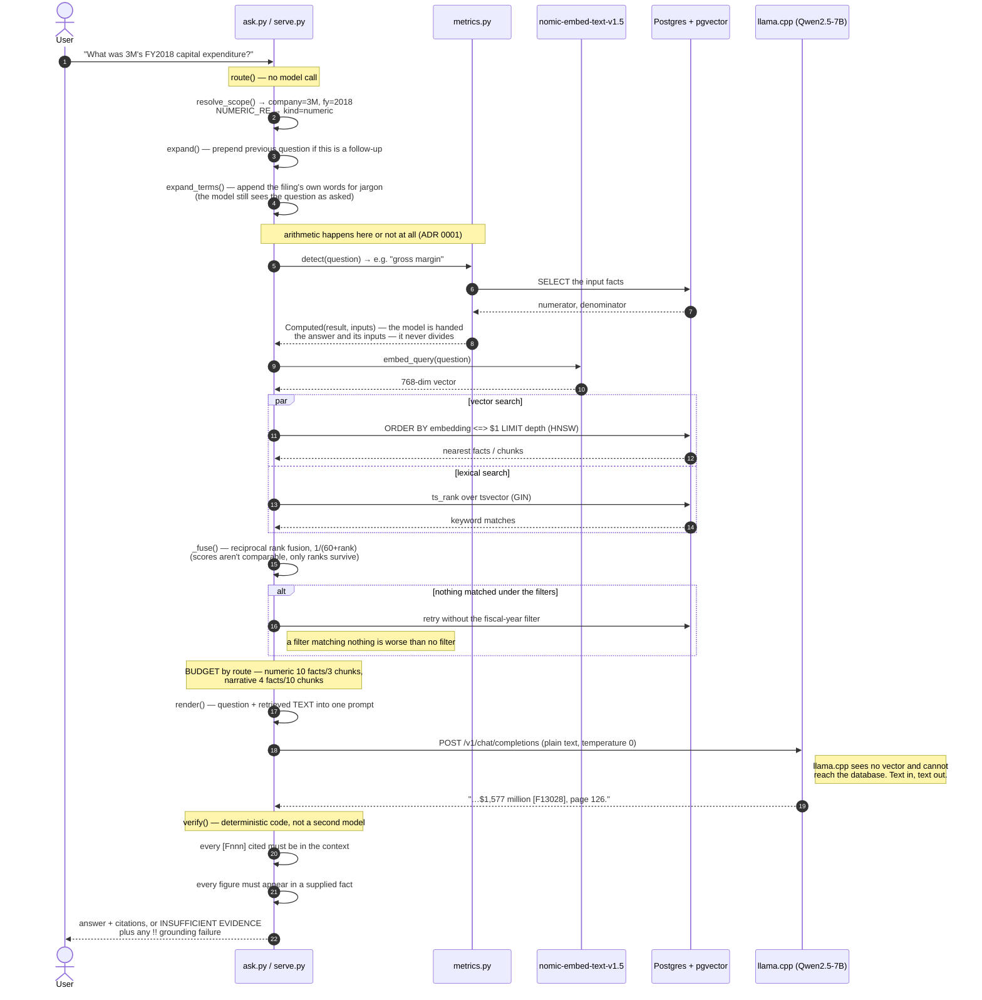
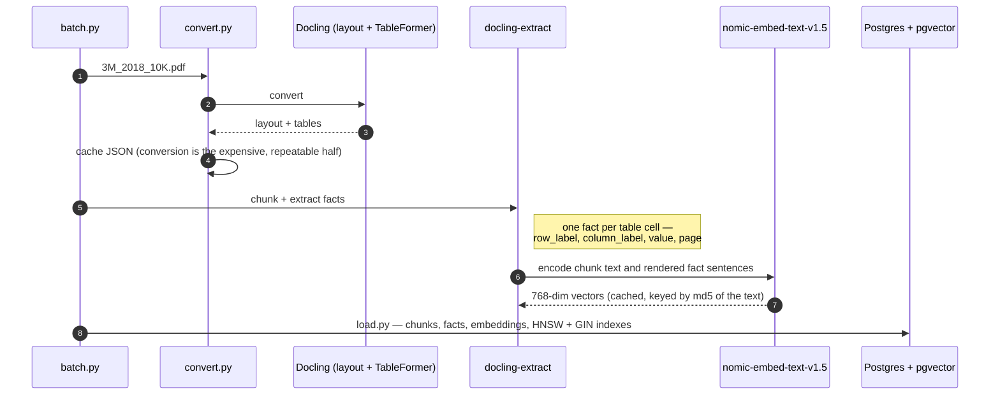

# Sequence — a question through the pipeline

Traced from the code, not the intent: `ask.py:answer_once` is the spine, and
every arrow below is a call you can find in `ask.py`, `search.py` or
`metrics.py`. `serve.py` runs the same spine for the chat UI.

The two things a demo audience usually asks about are marked: **the model is
never given a vector** (step 6 sends text), and **the model never does
arithmetic** (step 4 computes in code, step 9 checks it didn't).

## Per question



## Ingestion, once per filing



## Why the pieces are split this way

| Question | Answer |
|---|---|
| Does the model search the database? | No. It never sees a vector and holds no connection. `ask.py` retrieves, then hands it text. |
| Why not let the UI talk to Ollama directly? | It would answer SEC questions from memory. The UI talks to `serve.py`, which owns retrieval. |
| Why not Open WebUI's own RAG? | It would re-chunk the PDFs naively and discard the per-table-cell facts, the page numbers and the grounding checks. |
| Who does the arithmetic? | `metrics.py`, in code, before the prompt is built. The model selects a figure; it never computes one. |
| What stops a hallucinated number? | `verify()` — a figure not present in any supplied fact is reported as `!!`. It checks grounding, not correctness. |

## Rendering these

`docs/system/img/` holds PNGs of both diagrams, for slides. To regenerate
after editing the Mermaid above:

```bash
npx -y @mermaid-js/mermaid-cli -i diagram.mmd -o out.png -w 1800 -b white \
    -p pconf.json        # pconf.json: {"args":["--no-sandbox","--disable-setuid-sandbox"]}
```

The `-p` flag is not optional on this machine: Chromium's sandbox needs
unprivileged user namespaces, which AppArmor denies here, and without it
mermaid-cli fails with `No usable sandbox!`.

Mermaid treats `;` as a statement separator, so a semicolon inside message
text is a parse error — and the reported line number is the message's, which
makes it look like the arrow is malformed. Use a comma or a dash.
